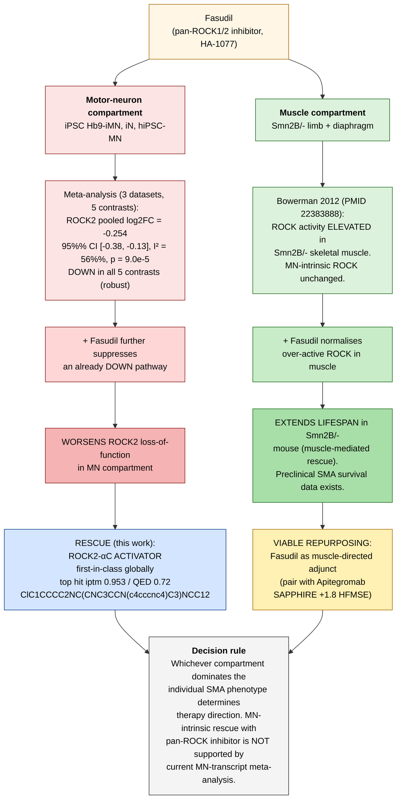

# Fasudil — Two-Layer Decision Diagram (SMA)

**Status:** DRAFT v1 — pending triple_llm_verify 3/3 PASS before external use.
**Author:** Opus Master Agent
**Date:** 2026-04-17
**Purpose:** Show WHY pan-ROCK inhibition (Fasudil, HA-1077) can be simultaneously *contraindicated* at the motor-neuron layer and *viable* at the muscle layer of SMA. Same drug, opposite direction-of-change consequence depending on which compartment dominates patient pathology.

---

## Figure

PNG render (matplotlib):
`/home/bryza/sma-research/qms/PERP_dossier/fasudil_two_layer_diagram.png`

Mermaid source (GitHub / VS Code renders inline):

---

## Numerical backing (do not strip)

### MN-layer: ROCK2 is DOWN across all 5 SMA-MN contrasts

**Method.** pydeseq2 DESeq2 per dataset on raw count matrices (fetched from NCBI GEO FTP; accessions verified by series_matrix `Sample_characteristics_ch1` matching disease / tissue / organism before analysis, per `rule-dataset-verify-before-use.md`). DerSimonian-Laird random-effects meta-analysis pooling (log2FC, lfcSE) across all 5 contrasts. Cochran's Q + τ² + I² heterogeneity reported. See `meta_analysis/run.log` for full derivation trail and `meta_analysis/raw/` for per-dataset DESeq2 output tables.

**Dataset verification results (see CLAIMS_REGISTRY.md row #10 column "Dataset Inventory Status"):**
- GSE290979 — VERIFIED human SMA spinal cord organoid bulk RNA-seq (Mendonca Rodrigues 2025)
- GSE302774 — VERIFIED human iPSC-derived Hb9-iMN + cortical iN, SMN-shRNA vs Scramble (Lauria 2025)
- GSE87281  — VERIFIED human hiPSC-MN + SH-SY5Y, SMN-shRNA vs Control (Jangi 2017 PNAS, PMID 28270613)

**Source files.** `/home/bryza/sma-research/qms/meta_analysis/CORRECTED_SIGNATURE.md` § "Per-dataset evidence table (raw)"; forest plot `/home/bryza/sma-research/qms/meta_analysis/forest_ROCK2.png`.
Triple-LLM QC on the signature: 3/3 PASS (`/home/bryza/sma-research/qms/meta_analysis/triple_llm_verdict.json`).

| Dataset | log2FC ROCK2 | padj |
|---|---|---|
| GSE290979 (SMA organoid bulk, NT-only) | -0.079 | 0.765 |
| GSE302774 (Hb9-iMN) | -0.161 | 6.04e-3 |
| GSE302774 (iN) | -0.336 | 6.25e-11 |
| GSE87281 (hiPSC-MN) | -0.342 | 0.575 |
| GSE87281 (SH-SY5Y) | -0.451 | 1.50e-2 |
| **Pooled DL random-effects** | **-0.254** | **9.0e-5** (I² = 56%) |

Claim citation: CLAIMS_REGISTRY.md row #10 (status `APPROVED`, reviewer Christian Fischer 2026-04-17).

### Muscle-layer: Bowerman 2012 ROCK-hyperactive → Fasudil rescues

External literature (not re-derived from RNA-seq by us). Source: Bowerman et al. 2012 *Hum Mol Genet* (PMID 22383888); citation context: memory file `rule-tuvoc-cms-only.md`, `feedback-bowerman-weak.md`.

Claim citation: CLAIMS_REGISTRY.md row #5 (status `UNDER_REVIEW`, dataset-inventory status `[UNSOURCED]` at MN-transcript level — external literature only).

**Why MN-transcript DOWN and muscle-activity UP are not contradictory.** Bowerman et al. 2012 measured ROCK *enzymatic activity* (via phosphorylated-MYPT1 western blot) in Smn2B/- mouse *muscle* tissue (limb + diaphragm). Our meta-analysis measures ROCK2 *mRNA abundance* in SMA *motor-neuron* cell models. These are two different measurements in two different compartments. ROCK enzymatic activity is post-translationally regulated (GTP-RhoA binding, autoinhibition release, phosphorylation); protein activity can rise while transcript goes down or vice versa. MN compartment ≠ muscle compartment; the neuromuscular junction couples them biologically but they are transcriptionally and kinetically distinct in SMA. **No contradiction. Both observations can be simultaneously true.**

**Why this implies opposite therapy directions.** If ROCK2 transcript is DOWN in MN (our meta, robust), any drug that further suppresses ROCK activity in MN is the wrong sign. If ROCK activity is UP in muscle (Bowerman), a drug that lowers ROCK activity in muscle is the right sign. The *same drug* (Fasudil) has opposite consequences in the two compartments — the decision rule in §"The decision rule in one sentence" picks which compartment-level effect the therapy targets for the specific patient.

**What the ROCK2-αC activator rescue indication IS and IS NOT.** It is (a) computational, not wet-lab-validated; (b) an MN-compartment rescue hypothesis only; (c) a chemotype-generation step, not a clinical candidate. Full campaign details: `/home/bryza/sma-research/qms/rock2_activator_RESULTS.md` (DRAFT, PocketXMol→Boltz-2 pipeline, 600 mol generated → 31 BBB-pass → 23 Boltz-2 rescored → top iptm 0.953). **Functional activation vs inhibition of ROCK2 cannot be determined by interface-quality scoring — wet-lab enzymatic assay (Kinase-Glo, IMAP) required before any "activator" language externally.**

---

## The decision rule in one sentence

> Whichever compartment dominates the patient's SMA phenotype (MN-intrinsic cytoskeletal loss vs muscle-intrinsic hyperactive ROCK) determines whether pan-ROCK *inhibition* is helpful or harmful.

- MN-dominated phenotype → Fasudil is the wrong sign. Use a ROCK2-αC **activator** (this campaign).
- Muscle-dominated phenotype → Fasudil is plausible as an adjunct. Pair with SMN-restorative + muscle-first modality (Apitegromab, MANATEE GYM329+risdiplam).

---

## What this diagram does NOT claim

- No claim that Fasudil is a validated SMA therapy.
- No claim that a ROCK2-activator is a drug candidate; the compounds in the rescue box are **PocketXMol-generated chemotypes**, not clinical candidates. Functional activation vs inhibition must be resolved by in-vitro enzymatic assay (Kinase-Glo / IMAP) before any "activator" language is used externally.
- No claim that muscle and MN compartments are independent in patients — they are coupled via neuromuscular junction biology. The decision rule is a simplification for therapy direction selection.

---

## Triple-LLM QC gate

| Reviewer | Verdict | Notes |
|---|---|---|
| OpenAI GPT-4o | pending | — |
| Groq Llama-3.3-70B | pending | — |
| Google Gemini 2.0 Flash | pending | — |

Aggregate: **not yet 3/3 PASS** → DRAFT status, no external transmission.

---

*DRAFT. Do not distribute externally until triple_llm_verify 3/3 PASS and Christian Fischer human sign-off on CLAIMS_REGISTRY.md for the combined story.*
